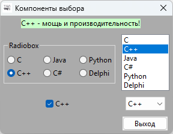

# DialogBlocks_Choice2_demo
Пример программы на C++ с использованием компонент выбора wxWidgets в DialogBlocks



```
/*
 * wxEVT_COMMAND_LISTBOX_SELECTED event handler for ID_LISTBOX
 */

// Обработчик выбора элемента в ListBox
void MainForm::OnListboxSelected( wxCommandEvent& event )
{
	int i = ListBox1->GetSelection(); // Получаем индекс выбранного элемента
	wxString s = ListBox1->GetString(i); // Получаем строку выбранного элемента
	UpdateSelectedValue(s); // Обрабатываем выбор пользователя
}


/*
 * wxEVT_COMMAND_CHOICE_SELECTED event handler for ID_CHOICE
 */

// Обработчик выбора элемента в Choice (выпадающем списке)
void MainForm::OnChoiceSelected( wxCommandEvent& event )
{
	int i = Choice1->GetSelection(); // Получаем индекс выбранного элемента
	wxString s = Choice1->GetString(i); // Получаем строку выбранного элемента
	UpdateSelectedValue(s); // Обрабатываем выбор пользователя
}


/*
 * wxEVT_COMMAND_RADIOBOX_SELECTED event handler for ID_RADIOBOX
 */

// Обработчик выбора варианта в RadioBox
void MainForm::OnRadioboxSelected( wxCommandEvent& event )
{
	int k = RadioBox1->GetSelection(); // Получаем индекс выбранного элемента
	wxString s = RadioBox1->GetString(k); // Получаем строку выбранного элемента
	UpdateSelectedValue(s); // Обрабатываем выбор пользователя
}


/*
 * wxEVT_COMMAND_CHECKBOX_CLICKED event handler for ID_CHECKBOX
 */

// Обработчик нажатия на CheckBox
void MainForm::OnCheckboxClick( wxCommandEvent& event )
{
	StaticText1->SetBackgroundColour(wxColour(255, 255, 255)); 
    bool b = CheckBox1->GetValue(); // Получаем текущее состояние чекбокса
	if (b == true) {
		StaticText1->SetLabel(wxString::FromUTF8("Да!")); // Устанавливаем "Да!" если включен
	} else {
		StaticText1->SetLabel(wxString::FromUTF8("Нет!")); // Устанавливаем "Нет!" если выключен
	}
}

// Универсальная функция для обработки выбранного значения
void MainForm::UpdateSelectedValue(const wxString& selectedValue)
{
    wxString message;
    wxColour backgroundColor;
    
    // Используем switch для определения сообщения и цвета фона
    if (selectedValue == wxT("C")) {
        message = wxT("C - классика программирования!");
        backgroundColor = wxColour(200, 200, 255); // Светло-синий
    } else if (selectedValue == wxT("C++")) {
        message = wxT("C++ - мощь и производительность!");
        backgroundColor = wxColour(200, 255, 200); // Светло-зеленый
    } else if (selectedValue == wxT("Java")) {
        message = wxT("Java - это круто!");
        backgroundColor = wxColour(255, 200, 200); // Светло-красный
    } else if (selectedValue == wxT("C#")) {
        message = wxT("C# - .NET решение для всего!");
        backgroundColor = wxColour(255, 255, 200); // Светло-желтый
    } else if (selectedValue == wxT("Python")) {
        message = wxT("Python - простота и элегантность!");
        backgroundColor = wxColour(200, 255, 255); // Светло-голубой
    } else if (selectedValue == wxT("Delphi")) {
        message = wxT("Delphi - быстрая разработка приложений!");
        backgroundColor = wxColour(255, 200, 255); // Светло-пурпурный
    } else {
        message = selectedValue;
        backgroundColor = wxColour(240, 240, 240); // Стандартный серый
    }
    
    // Устанавливаем новый текст и цвет фона
    StaticText1->SetLabel(message);
    StaticText1->SetBackgroundColour(backgroundColor);
    
    // Заставляем StaticText1 перерисоваться для отображения изменений
    StaticText1->Refresh();
}
```

## Ссылки:

http://www.anthemion.co.uk/dialogblocks/

***Бесплатная лицензия на DialogBlocks:*** https://github.com/proffix4/dialogblocks_free

https://www.wxwidgets.org/

https://visualstudio.microsoft.com/ru/vs/community/

http://www.anthemion.co.uk/dialogblocks/ImageBlocks-1.07-Setup.exe

